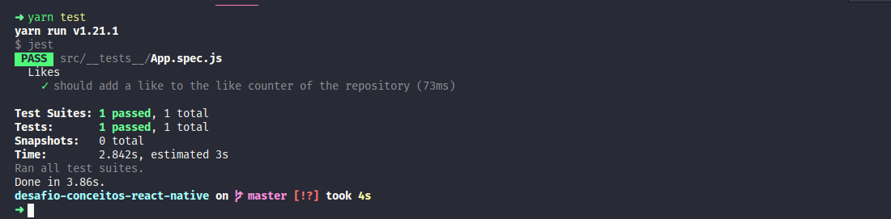

<h1 align="center">Desafio 04: Conceitos do React Native -  GoStack Turma 11</h1>

### Sobre o desafio

- Desafio 04 do bootcamp da Rocketseat onde apliquei os conceitos aprendidos no mõdulo <strong>Mobile com React Native</strong>

### Objetivo
- Continuar desenvolvendo a aplicação que irá armazenar repositórios do seu portfólio, que você já desenvolveu o backend no último desafio utilizando o Node.js.

### Testes
- Após a implementação os testes devem ser executados para que possa ser avaliado todos os pontos do desafio proposto.

### Resultado dos testes:

**Rocketseat!! GoStack11!! Desafio04 React Native!!**